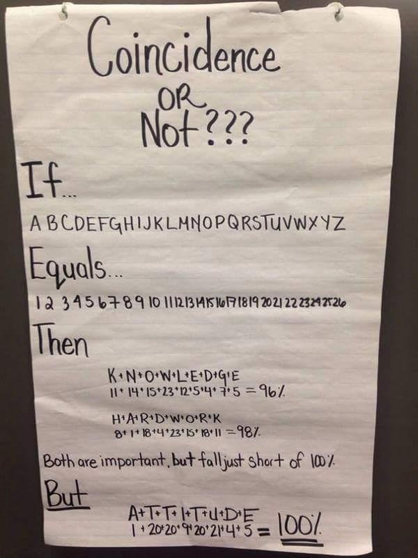

This started with someone sharing with me something similar the image below.  The intention was to motivate (young?) people that *attitude* matters.  Although the premise of the message in this image was a little preposterous - it doesn't even make sense that word would sum to a percentage - it did raise an interesting question: how many other words have a sum of 100?  That raised an interesting question, and provided an opportunity to show how many other words have a value using this somewhat silly encoding system.

